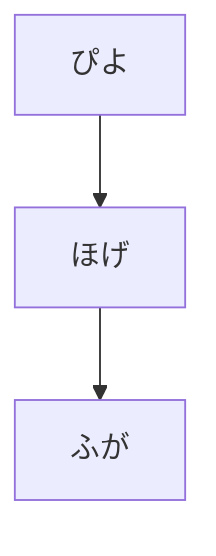

# draftPythonistaScripts

とりあえず、試しコードや素振り的なものをおいておく

あとは、issue 書きながら調整


あと、文章的なのも


## mermaid サポートテスト





```mermaid
pyramid
    "Sky" : 386
    "Sunny side of pyramid" : 85
    "Shady side of pyramid" : 15
```

