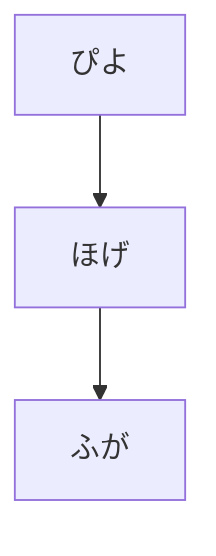
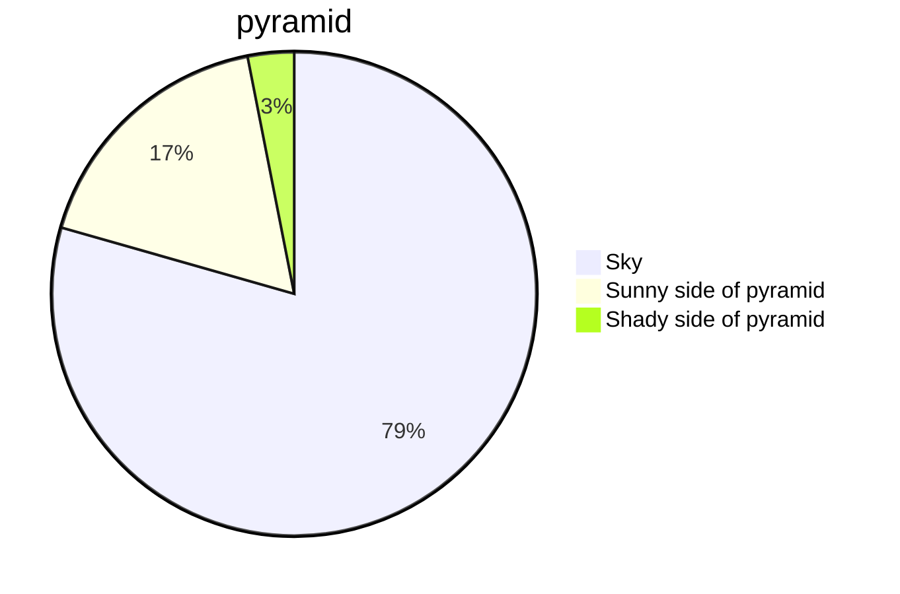

# draftPythonistaScripts

とりあえず、試しコードや素振り的なものをおいておく

あとは、issue 書きながら調整

あと、文章的なのも

## mermaid サポートテスト

## TeX or LaTeX テスト

When $a \ne 0$, there are two solutions
to $(ax^2 + bx + c = 0)$ and they are
$$ x = {-b \pm \sqrt{b^2-4ac} \over 2a} $$

## iOS GitHub app で直接編集できるってマ？

はえーまじか

