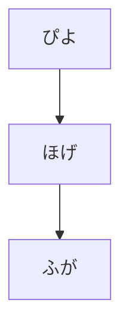
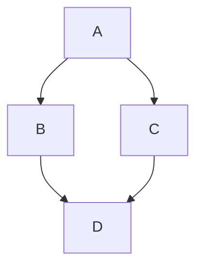
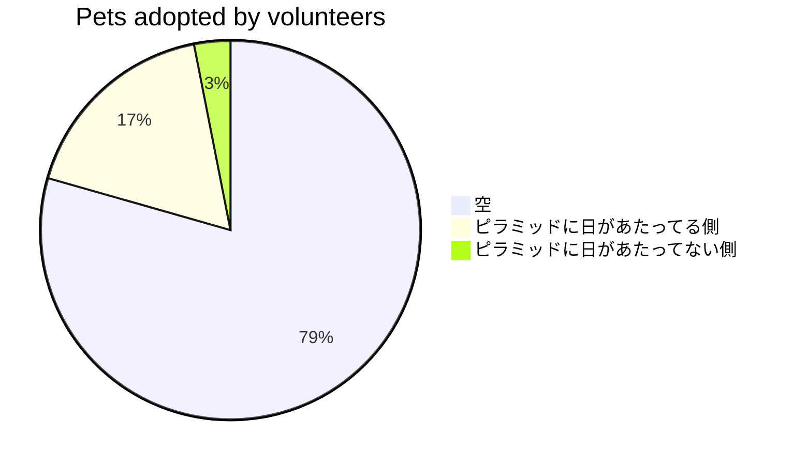

# draftPythonistaScripts

とりあえず、試しコードや素振り的なものをおいておく

あとは、issue 書きながら調整

あと、文章的なのも

## mermaid サポートテスト

```mermaid
 graph TD;
    ほげ-->ふが;
    ぴよ-->ほげ;
```

```mermaid
graph TD;
    A-->B;
    A-->C;
    B-->D;
    C-->D;
```

```mermaid
pie title Pets adopted by volunteers
    "空" : 386
    "ピラミッドに日があたってる側" : 85
    "ピラミッドに日があたってない側" : 15
```

